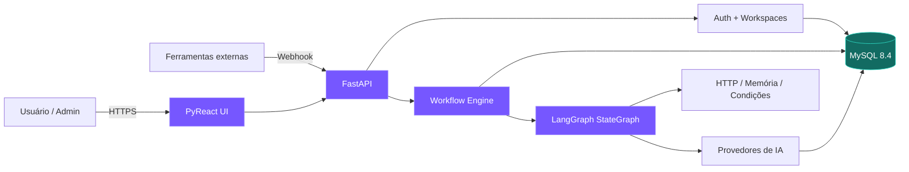
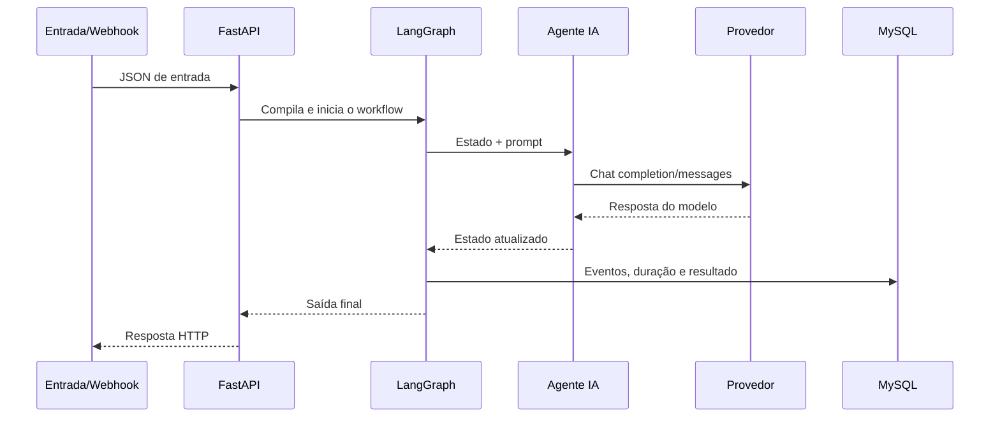

<div align="center">

# Agentic Flow

### Crie, conecte e execute equipes de agentes de IA sem escrever código.

Uma plataforma low-code para construir workflows multiagente, integrar modelos,
receber webhooks e acompanhar cada execução visualmente.

[](https://github.com/wanbnn/agenticflow/actions/workflows/ci.yml)
[](https://www.python.org/)
[](https://github.com/wanbnn/pyreact)
[](https://github.com/langchain-ai/langgraph)
[](https://fastapi.tiangolo.com/)
[](https://www.mysql.com/)
[](https://www.docker.com/)
[](LICENSE)
[](https://github.com/wanbnn/agenticflow/stargazers)
[](https://github.com/wanbnn/agenticflow/issues)

[Início rápido](#-início-rápido-com-docker) ·
[Recursos](#-recursos) ·
[Arquitetura](#-arquitetura) ·
[Contribuir](CONTRIBUTING.md) ·
[Segurança](SECURITY.md)

</div>

---

## Por que Agentic Flow?

Ferramentas tradicionais de automação conectam tarefas. O Agentic Flow foi
desenhado para conectar **agentes**, **modelos**, **memória**, **decisões** e
**ferramentas externas** em uma experiência visual acessível também a quem não
programa.

- Arraste nós para o canvas e conecte as etapas.
- Crie quantos agentes precisar em um mesmo workflow.
- Configure provedores e chaves pela interface.
- Publique entradas por webhook com URL exclusiva.
- Teste com dados reais e acompanhe o tracing por nó.
- Administre múltiplos workspaces e libere usuários em cada ambiente.
- Organize usuários em times com políticas de workflows, execução, provedores e tipos de nó.

## ✨ Recursos

| Área | Capacidades |
| --- | --- |
| Editor visual | Drag-and-drop, conexões, zoom, minimapa, auto-layout, undo/redo e inspetor |
| Multiagente | Papéis independentes, prompts, campos de entrada/saída e colaboração sequencial ou ramificada |
| Nós | Entrada, Webhook, Prompt, LLM, Agente, Banco de Vetores, RAG, MCP Server, Condição, Documentos, Imagens, Vídeo para frames, Transformação, HTTP, Memória e Saída |
| Templates | Biblioteca de workflows prontos para documentos, imagens, vídeos, atendimento e pipelines multiagente |
| Conhecimento | Banco de Vetores nativo por nó, ingestão persistente, busca semântica local e RAG conectado a agentes |
| Provedores | OpenAI, Anthropic, Ollama, Groq, OpenRouter, Gemini, Mistral e APIs compatíveis |
| Segurança | RBAC Admin/Manager/User, multi-workspace, times, políticas, sessões assinadas e credenciais criptografadas |
| Operação | MySQL, histórico de runs, healthcheck, volumes Docker e API OpenAPI em `/docs` |
| Integrações | Webhooks persistentes e requisições HTTP para serviços externos |

### Arquivos e mídia

O playground permite anexar um arquivo diretamente a qualquer campo da entrada
JSON. Os nós multimídia recebem o asset como data URI/base64 e produzem saídas
que podem ser conectadas aos próximos nós:

- **Ler documento:** PDF, TXT, Markdown, CSV, JSON, XML, HTML, YAML, DOCX e XLSX.
- **Processar imagem:** PNG, JPEG, WebP, GIF, BMP e TIFF; inspeção,
  redimensionamento, conversão e escala de cinza.
- **Vídeo para frames:** MP4, WebM, MOV, AVI e formatos reconhecidos pelo
  OpenCV, com intervalo, limite e formato de frame configuráveis.

O limite padrão por asset é 25 MB e pode ser alterado com
`AGENTIC_FLOW_MAX_ASSET_MB`.

### Banco de Vetores e RAG

Cada nó **Banco de Vetores** cria uma coleção persistente própria, isolada pelo
workspace, workflow e ID do nó. O conteúdo recebido é dividido em trechos,
vetorizado localmente e deduplicado antes de ser armazenado no MySQL ou SQLite.
O modo `append` mantém o conhecimento anterior e `replace` recria o conteúdo da
coleção a cada execução.

O nó **Busca RAG** seleciona uma dessas bases, consulta os trechos mais próximos
e publica `rag_context` e `rag_matches` para as próximas etapas. Também é
possível selecionar o Banco de Vetores diretamente no inspetor de um
**Agente IA**; nesse caso, o agente recupera e incorpora o contexto
automaticamente antes de chamar o modelo.

### Alças tipadas e ferramentas

As conexões do canvas distinguem dois comportamentos:

- **input/output:** controlam a ordem normal de execução do workflow;
- **database/tool/tools:** conectam recursos ao agente sem transformá-los em
  etapas sequenciais.

Para disponibilizar RAG a um agente, conecte `database` do Banco de Vetores em
`database` do RAG e conecte `tool` do RAG em `tools` do Agente IA. Para
ferramentas externas, configure um nó **MCP Server** com um endpoint Streamable
HTTP e conecte sua alça `tool` em `tools` do agente. O cliente negocia o
protocolo MCP, descobre `tools/list`, escolhe a ferramenta compatível com a
consulta e a executa com `tools/call`; o resultado passa a compor o contexto do
agente.

## 🚀 Início rápido com Docker

> [!IMPORTANT]
> **Você não precisa instalar Python, PyReact, LangGraph, FastAPI, MySQL,
> bibliotecas Python ou ferramentas de build no computador.** O Dockerfile
> instala automaticamente todo o ambiente da aplicação, enquanto o Compose
> configura o MySQL e a rede entre os serviços.

### Pré-requisitos

Somente:

- [Git](https://git-scm.com/);
- [Docker](https://docs.docker.com/get-docker/) com Docker Compose.

### 1. Clone e configure

```bash
git clone https://github.com/wanbnn/agenticflow.git
cd agenticflow
cp .env.example .env
```

No PowerShell, use `Copy-Item .env.example .env`.

Troque os valores abaixo no `.env` antes de expor a instalação:

```dotenv
MYSQL_PASSWORD=uma-senha-forte
MYSQL_ROOT_PASSWORD=outra-senha-forte
SESSION_SECRET=uma-string-aleatoria-longa
CREDENTIALS_ENCRYPTION_KEY=outra-string-aleatoria-longa
COOKIE_SECURE=false
```

### 2. Suba a plataforma

```bash
docker compose up -d --build
docker compose ps
```

O build instala no container:

- Python 3.12 e pip;
- PyReact;
- FastAPI e Uvicorn;
- LangGraph e LangChain Core;
- SQLAlchemy e PyMySQL;
- clientes HTTP nativos para protocolos OpenAI e Anthropic;
- criptografia, autenticação e todas as dependências do `pyproject.toml`.

O Compose também baixa e configura o **MySQL 8.4**, cria o banco
`agentic_flow`, aplica healthchecks e só inicia a aplicação quando o banco
estiver saudável.

### 3. Crie o administrador

Abra [http://127.0.0.1:16777](http://127.0.0.1:16777).

No primeiro acesso, o sistema redireciona obrigatoriamente para `/setup`.
Crie o administrador e o primeiro workspace. Depois do bootstrap, todos os
acessos exigem login.

> [!TIP]
> Para acompanhar a inicialização, execute
> `docker compose logs -f agentic-flow`.

## 💾 Persistência e redeploy

O Compose cria dois volumes nomeados:

| Volume | Conteúdo |
| --- | --- |
| `agentic_flow_mysql_data` | Usuários, workspaces, memberships, provedores, workflows e execuções |
| `agentic_flow_app_data` | Dados auxiliares da aplicação |

Rebuilds, atualizações de imagem e `docker compose down` **não apagam os
dados**. O comando `docker compose down -v` remove deliberadamente os volumes e
deve ser usado somente quando a intenção for apagar a instalação.

Para produção com HTTPS:

```dotenv
COOKIE_SECURE=true
```

Mantenha `SESSION_SECRET` e `CREDENTIALS_ENCRYPTION_KEY` estáveis entre
redeploys. A troca da chave de criptografia sem migração impede a leitura das
API keys armazenadas.

## 🧠 Provedores de IA

O administrador configura tudo em **Configurações → Provedores de IA**:

- OpenAI e Anthropic oficiais;
- OpenAI-compatible `/v1`;
- Anthropic-compatible;
- Ollama local;
- presets de Groq, OpenRouter, Google Gemini e Mistral.

Informe nome, URL base, modelo padrão e API key. As chaves são criptografadas
antes de chegar ao MySQL e nunca retornam ao navegador. Nos nós **Agente IA** e
**Modelo LLM**, o usuário apenas seleciona o provedor pelo nome.

Não é necessário colocar chaves de modelos no `.env`.

## 🪝 Webhooks

Ao salvar um nó **Webhook**, o Agentic Flow gera uma URL aleatória e persistente:

```text
https://seu-dominio.example/webhooks/wh_TOKEN_ALEATORIO
```

Envie qualquer objeto JSON por `POST`:

```bash
curl -X POST \
  -H "Content-Type: application/json" \
  -d '{"message":"Nova mensagem externa"}' \
  https://seu-dominio.example/webhooks/wh_TOKEN_ALEATORIO
```

O JSON torna-se a entrada do workflow, a execução começa exatamente naquele
gatilho e o resultado fica registrado no histórico.

## 🏗 Arquitetura



### Fluxo de execução



## 🗂 Estrutura do projeto

```text
agentic_flow/
├── catalog.py       # catálogo e schema dos nós
├── engine.py        # compilação e execução LangGraph
├── main.py          # API, auth e rotas
├── models.py        # contratos Pydantic
├── providers.py     # protocolos e criptografia de credenciais
├── store.py         # persistência MySQL/SQLite via SQLAlchemy
├── ui.py            # componentes declarativos PyReact
└── static/          # canvas, dashboard, auth, provedores e estilos
```

## 🧪 Desenvolvimento e testes

O caminho recomendado continua sendo Docker. Para desenvolvimento nativo
opcional, use Python 3.11+:

```bash
python -m pip install -e ".[dev]"
python -m pytest
python -m agentic_flow.main
```

Sem MySQL configurado, o modo nativo utiliza SQLite em
`data/agentic-flow-v2.db`. A aplicação fica em `http://127.0.0.1:16777` e a
documentação da API em `http://127.0.0.1:16777/docs`.

## 🧩 Criando um novo tipo de nó

1. Adicione a definição e os campos em `NODE_CATALOG`.
2. Implemente o executor em `WorkflowEngine._execute_node`.
3. Inclua testes unitários e de integração.
4. Atualize a documentação quando houver comportamento público novo.

O mesmo catálogo alimenta sidebar, inspetor, validação e execução, reduzindo
divergências entre frontend e backend.

## 🤝 Comunidade

Antes de participar, consulte:

- [Guia de contribuição](CONTRIBUTING.md)
- [Código de conduta](CODE_OF_CONDUCT.md)
- [Política de segurança](SECURITY.md)
- [Suporte](SUPPORT.md)
- [Governança](GOVERNANCE.md)
- [Changelog](CHANGELOG.md)

### Colaboradores

<a href="https://github.com/wanbnn/agenticflow/graphs/contributors">
  
</a>

### Histórico de estrelas

[](https://star-history.com/#wanbnn/agenticflow&Date)

<sub>Badges e gráficos fornecidos por serviços externos são renderizados quando
o repositório está público e pode ser consultado por esses serviços.</sub>

## 📄 Licença

Distribuído sob a licença MIT. Consulte [LICENSE](LICENSE).

---

<div align="center">

Se o Agentic Flow for útil para você, considere deixar uma
[⭐ estrela](https://github.com/wanbnn/agenticflow).

</div>
