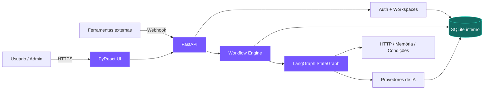
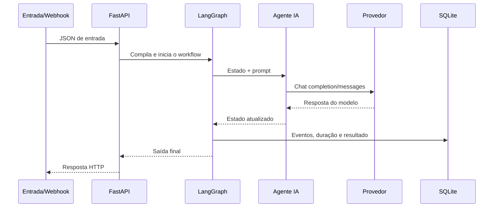

<div align="center">

# Agentic Flow

### Crie, conecte e execute equipes de agentes de IA sem escrever código.

Uma plataforma low-code para construir workflows multiagente, integrar modelos,
receber webhooks e acompanhar cada execução visualmente.

[](https://github.com/wanbnn/agenticflow/actions/workflows/ci.yml)
[](https://www.python.org/)
[](https://github.com/wanbnn/pyreact)
[](https://github.com/wanbnn/uikitpr)
[](https://github.com/wanbnn/6cons)
[](https://github.com/langchain-ai/langgraph)
[](https://fastapi.tiangolo.com/)
[](https://pypi.org/project/agenticflow-studio/)
[](https://sqlite.org/)
[](https://www.docker.com/)
[](LICENSE)
[](https://github.com/wanbnn/agenticflow/stargazers)
[](https://github.com/wanbnn/agenticflow/issues)

[Início rápido](#-instalação) ·
[Recursos](#-recursos) ·
[Arquitetura](#-arquitetura) ·
[Contribuir](CONTRIBUTING.md) ·
[Segurança](SECURITY.md)

</div>

---

## Por que Agentic Flow?

Ferramentas tradicionais de automação conectam tarefas. O Agentic Flow foi
desenhado para conectar **agentes**, **modelos**, **memória**, **decisões** e
**ferramentas externas** em uma experiência visual acessível também a quem não
programa.

- Arraste nós para o canvas e conecte as etapas.
- Crie quantos agentes precisar em um mesmo workflow.
- Configure provedores e chaves pela interface.
- Publique entradas por webhook com URL exclusiva.
- Teste com dados reais e acompanhe o tracing por nó.
- Administre múltiplos workspaces e libere usuários em cada ambiente.
- Organize usuários em times com políticas de workflows, execução, provedores e tipos de nó.

As conexões transportam os dados automaticamente entre os nós. O runtime dá
prioridade à saída do nó conectado, reconhece texto, imagem, áudio, vídeo e
arquivos pelo conteúdo e cria os aliases necessários. Os nomes técnicos de
entrada e saída no inspetor são opcionais e servem apenas para sobrescrever o
comportamento automático em integrações avançadas.

## ✨ Recursos

| Área | Capacidades |
| --- | --- |
| Editor visual | Drag-and-drop, conexões, zoom, minimapa, auto-layout, undo/redo e inspetor |
| Multiagente | Papéis independentes, prompts, campos de entrada/saída e colaboração sequencial ou ramificada |
| Nós | Entradas tipadas, LLM, modelo local multimodal, Agente, Banco de Vetores, RAG, MCP, documentos, imagem, vídeo, HTTP, memória e saída |
| Templates | 21 workflows prontos para RAG, Vector DB, MCP, HTTP, memória, condições, bancos SQL, mídia, LLM e equipes de agentes |
| Conhecimento | Banco de Vetores nativo por nó, ingestão persistente, busca semântica local e RAG conectado a agentes |
| Provedores | OpenAI, Anthropic, Ollama, Hugging Face local, Groq, OpenRouter, Gemini, Mistral e APIs compatíveis |
| Segurança | RBAC Admin/Manager/User, multi-workspace, times, políticas, sessões assinadas e credenciais criptografadas |
| Operação | SQLite interno, histórico de runs, healthcheck, volumes Docker e API OpenAPI em `/docs` |
| Integrações | Webhooks persistentes e requisições HTTP para serviços externos |

### Arquivos e mídia

O playground cria automaticamente o controle adequado para cada nó de entrada:
campo de texto e seletores de imagem, vídeo ou áudio com preview/player.
Não é necessário conhecer nomes de campos para conectar e executar esses fluxos.
A entrada JSON continua disponível como configuração avançada para integrações.

Os resultados de mídia são exibidos visualmente no próprio nó e no painel de
execução. Imagens possuem preview ampliado, vídeos usam player nativo e a
extração de frames produz uma galeria navegável com miniaturas e timestamps.

- **Ler documento:** PDF, TXT, Markdown, CSV, JSON, XML, HTML, YAML, DOCX e XLSX.
- **Processar imagem:** PNG, JPEG, WebP, GIF, BMP e TIFF; inspeção,
  redimensionamento, conversão e escala de cinza.
- **Vídeo para frames:** MP4, WebM, MOV, AVI e formatos reconhecidos pelo
  OpenCV, com intervalo, limite e formato de frame configuráveis.

O limite padrão por asset é 25 MB e pode ser alterado com
`AGENTIC_FLOW_MAX_ASSET_MB`.

### Inferência self-hosted e Hugging Face

Em **Configurações → Provedores de IA → Modelos Hugging Face locais**, o
administrador encontra uma biblioteca organizada por modalidade, pesquisa o
Hub e instala diretamente pelo cartão do modelo. A interface mostra
popularidade, tendência, tamanho estimado e compatibilidade com a GPU/CPU
local. O catálogo é paginado e pode ser ordenado por modelos em alta,
downloads, curtidas ou atualização recente; task, revisão, backend e pacotes
são resolvidos pelo AgenticFlow. A instalação por `repository_id` continua
disponível como opção avançada. O token informado para um modelo privado é
usado somente durante o download e não é armazenado.

Repositórios **GGUF** abrem um seletor de quantização antes da instalação. A
biblioteca agrupa automaticamente arquivos divididos em shards, exibe o
tamanho real de cada variante e destaca Q4/Q5 como equilíbrio recomendado. O
AgenticFlow baixa somente a variante escolhida e, quando disponível, permite
incluir o `mmproj` necessário para entrada de imagem.

O `start.bat` instala automaticamente o binário oficial mais recente do
`llama.cpp` em `data/llama.cpp`. A GPU é detectada sem configuração manual:
AMD usa HIP/ROCm, NVIDIA usa CUDA e inclui o runtime CUDA correspondente,
outros GPUs tentam Vulkan e máquinas sem GPU usam CPU. Modelos GGUF rodam em
um processo `llama-server` isolado, mantendo a fila e a regra de somente um
modelo local ativo. Isso impede que uma falha nativa do runtime derrube o
servidor web do AgenticFlow.

O backend GGUF/llama.cpp é destinado a LLMs e modelos multimodais compatíveis
que recebem texto e, com `mmproj`, imagem. Geração de imagem, vídeo, áudio e 3D
continua no runtime PyTorch/Diffusers da aplicação; esses modelos não são
convertidos para llama.cpp.

Snapshots que declaram implementações próprias por `auto_map` são detectados
automaticamente. Nesses casos, o runtime habilita `trust_remote_code` para os
arquivos já baixados no diretório local do modelo, sem exigir configuração no
nó ou no workflow.

Para pipelines de imagem e 3D, a instalação valida a presença de
`model_index.json`. Quando o repositório escolhido contém somente checkpoints
de treinamento, o AgenticFlow procura automaticamente uma variante
`_diffusers` ou `-diffusers`; modelos sem formato executável permanecem em erro
com uma orientação clara, em vez de serem marcados incorretamente como prontos.

Um `model_index.json` isolado não é considerado suficiente: conversões MLX e
CoreML destinadas a Apple não são carregadas como se fossem PyTorch. Quando o
repositório declara `base_model`, o AgenticFlow baixa automaticamente a
variante Diffusers compatível. Classes experimentais conhecidas, como
`WanDMDPipeline`, são adaptadas para o pipeline Wan disponível e adequado à
tarefa. Ao alternar modelos locais, o runtime aguarda os kernels ROCm/CUDA,
remove o pipeline anterior e limpa o cache da GPU antes do próximo carregamento.

O nó **Modelo local multimodal** executa no servidor modelos de geração de
texto, visão, reconhecimento e síntese de áudio, geração de imagem, 3D e
embeddings. Um modelo de `text-generation` também pode ser selecionado como
modelo padrão de um provedor **Hugging Face local**, permitindo reutilizá-lo
nos nós LLM e Agente. Os pipelines são carregados sob demanda, mantidos em
cache e descarregados automaticamente ao sair do workflow ou após 60 segundos
sem inferência, liberando RAM/VRAM. O intervalo pode ser configurado por
`AGENTIC_FLOW_MODEL_IDLE_SECONDS`.

A biblioteca e o seletor do nó exibem capacidades como **Aceita imagem**,
**Aceita texto**, **Retorna texto** e **Gera imagem**. Modelos
`image-text-to-text` aparecem em **LLMs multimodais**. Ao conectar a saída de
um gerador de imagem a um desses modelos, o AgenticFlow extrai a imagem,
adiciona a instrução de avaliação configurada no nó e usa o processor visual
correto. Modelos somente-texto ficam desabilitados nessa conexão para evitar o
envio acidental de base64 como prompt.

Quando o processor oferece chat template multimodal, a imagem é inserida como
bloco `{type: image}` na mensagem. Isso permite que templates Qwen VL, LLaVA,
Mllama e compatíveis criem automaticamente seus tokens visuais; pipelines de
caption sem chat template continuam recebendo `images` e `text` separadamente.

Inferências self-hosted passam por uma fila FIFO exclusiva. Somente um modelo
local permanece carregado por vez: quando o próximo item da fila usa outro
modelo, o pipeline anterior é removido da RAM/VRAM antes do carregamento. Essa
serialização não se aplica a providers por API, que continuam executando com a
concorrência normal do grafo.

No Windows com ROCm, o launcher usa Python 3.12, desativa kernels SDP
experimentais e habilita o caminho matemático estável. O descarregamento remove
diretamente as referências da GPU, sem copiar pesos para a RAM. Se o driver
ainda encerrar nativamente o processo, `start.bat` recupera o servidor com um
limite de três tentativas para evitar um ciclo de falhas.

Para desenvolvimento local em CPU/CUDA, instale `pip install -e
".[self-hosted]"`. No Windows, `start.bat` detecta automaticamente GPUs AMD por
`clinfo`, `hipInfo` ou `rocminfo`, resolve uma ou mais arquiteturas `gfx` e usa
o índice ROCm 7.14 da AMD. Se a placa for AMD mas a arquitetura ainda for
desconhecida, usa `device-all`. A instalação só é marcada como pronta depois
que PyTorch confirma HIP e acesso real à GPU. O endpoint
`GET /api/local-models/hardware` mostra o backend, a versão HIP/ROCm e as GPUs
que o processo detectou.

Endpoints principais:

- `GET /api/huggingface/models` pesquisa o Hub;
- `POST /api/huggingface/gguf-variants` lista quantizações e arquivos `mmproj`;
- `GET /api/llama-cpp/status` mostra backend, versão e processo ativo;
- `POST /api/llama-cpp/install` instala o runtime oficial sob demanda;
- `POST /api/local-models` registra e baixa um modelo;
- `POST /api/local-models/{id}/infer` executa inferência multimodal;
- `POST /api/local-models/{id}/unload` libera RAM/VRAM;
- `POST /api/workflows/{id}/release-models` libera os modelos usados pelo workflow;
- `DELETE /api/local-models/{id}` remove o registro e o snapshot local.

### Banco de Vetores e RAG

Cada nó **Banco de Vetores** cria uma coleção persistente própria, isolada pelo
workspace, workflow e ID do nó. O conteúdo recebido é dividido em trechos,
vetorizado localmente e deduplicado antes de ser armazenado no SQLite interno.
O modo `append` mantém o conhecimento anterior e `replace` recria o conteúdo da
coleção a cada execução.

O nó **Busca RAG** recebe uma dessas bases pela alça `database`, consulta os
trechos mais próximos e é conectado à alça `tools` de um agente. O agente
recupera e incorpora o contexto automaticamente antes de chamar o modelo.

### Biblioteca de templates

A biblioteca inclui fluxos prontos para resumo de documentos, otimização de
imagens, extração visual de frames, pesquisa multiagente, atendimento por
webhook, ingestão vetorial, conversa com documentos via RAG, agentes com MCP,
operações combinando RAG e MCP, enriquecimento por HTTP, relay de webhooks,
memória de contexto e roteamento condicional. Templates que dependem de um
endpoint ou dado externo exibem no próprio cartão o que precisa ser configurado
antes da primeira execução.

### Bancos de dados como ferramentas

Cada workspace possui um painel em **Configurações → Bancos de dados** para
cadastrar, testar, editar e remover conexões. MySQL, PostgreSQL, SQL Server,
SQLite, BigQuery e MariaDB possuem nós separados no catálogo; o workflow guarda
somente o ID da conexão, enquanto senhas e service accounts permanecem
criptografadas no servidor.

Esses nós podem inspecionar schemas, executar consultas de leitura e ser ligados
à alça `tools` de um Agente IA. O runtime aceita apenas `SELECT`, `WITH`,
`EXPLAIN`, `SHOW`, `DESCRIBE` e `PRAGMA`, rejeita múltiplas instruções e
operações de escrita e limita o retorno a no máximo 1.000 linhas.

### Alças tipadas e ferramentas

As conexões do canvas distinguem dois comportamentos:

- **input/output:** controlam a ordem normal de execução do workflow;
- **database/tool/tools:** conectam recursos ao agente sem transformá-los em
  etapas sequenciais.

Nos fluxos `input/output`, não é necessário combinar manualmente nomes de
variáveis. Mesmo que dois nós tenham campos configurados com nomes diferentes,
a conexão direta é a fonte de dados principal e o tipo esperado pelo nó de
destino é inferido automaticamente.

Para disponibilizar RAG a um agente, conecte `database` do Banco de Vetores em
`database` do RAG e conecte `tool` do RAG em `tools` do Agente IA. Para
ferramentas externas, configure um nó **MCP Server** com um endpoint Streamable
HTTP e conecte sua alça `tool` em `tools` do agente. O cliente negocia o
protocolo MCP, descobre `tools/list`, escolhe a ferramenta compatível com a
consulta e a executa com `tools/call`; o resultado passa a compor o contexto do
agente.

## 🚀 Instalação

### Shell — recomendado no Linux

```bash
curl -fsSL https://raw.githubusercontent.com/wanbnn/agenticflow/main/install.sh | sh
```

O instalador prepara Python 3.12 com `uv`, instala o AgenticFlow em um ambiente
isolado, detecta NVIDIA/AMD/CPU e resolve CUDA, ROCm ou CPU. Depois, abra um
novo terminal e execute:

```bash
agenticflow
```

### PowerShell — recomendado no Windows

```powershell
powershell -ExecutionPolicy ByPass -c "irm https://raw.githubusercontent.com/wanbnn/agenticflow/main/install.ps1 | iex"
```

O instalador prepara Python 3.12 e `pipx`, instala o AgenticFlow isoladamente,
detecta NVIDIA/AMD/Apple/CPU e resolve CUDA, ROCm, MPS ou CPU. Depois, abra um
novo terminal e execute:

```powershell
agenticflow
```

O navegador abre automaticamente em `http://127.0.0.1:16777`.

### PyPI

```bash
pip install agenticflow-studio
agenticflow
```

Na primeira execução, `agenticflow` instala somente o runtime adequado ao
hardware e o binário correspondente do llama.cpp. Comandos úteis:

```bash
agenticflow install          # instala ou repara runtimes
agenticflow doctor           # diagnóstico de GPU, PyTorch, llama.cpp e SQLite
agenticflow serve --no-browser
```

### Inicialização direta no Windows

Execute `start.bat` na raiz do projeto. Na primeira execução ele localiza ou
instala Python compatível, cria `.venv`, detecta automaticamente CPU ou GPU AMD,
instala o runtime adequado e inicia em `http://127.0.0.1:16777`. Use
`AGENTIC_FLOW_AMD_GFX=gfx1200` somente para sobrescrever a detecção, ou
`AGENTIC_FLOW_DISABLE_ROCM=1` para forçar CPU.

### Inicialização direta no Linux

Execute `./start.sh` na raiz do projeto. Na primeira execução ele prepara
Python 3.12, cria `.venv`, instala o projeto e o runtime adequado ao hardware e
inicia em `http://127.0.0.1:16777`:

```bash
git clone https://github.com/wanbnn/agenticflow.git
cd agenticflow
./start.sh
```

Use `./start.sh --install-only` para apenas preparar o ambiente e
`./start.sh --check-gpu` para exibir o diagnóstico dos runtimes.

### Docker

O container também usa SQLite e precisa somente de um volume persistente:

```bash
git clone https://github.com/wanbnn/agenticflow.git
cd agenticflow
cp .env.example .env
docker compose up -d --build
docker compose ps
```

O build instala no container:

- Python 3.12 e pip;
- PyReact;
- UIKitPR e 6cons;
- FastAPI e Uvicorn;
- LangGraph e LangChain Core;
- SQLAlchemy, SQLite e drivers dos nós de banco;
- clientes HTTP nativos para protocolos OpenAI e Anthropic;
- criptografia, autenticação, Transformers, Diffusers, PyTorch e Hugging Face Hub.

### Primeiro acesso

Abra [http://127.0.0.1:16777](http://127.0.0.1:16777).

No primeiro acesso, o sistema redireciona obrigatoriamente para `/setup`.
Crie o administrador e o primeiro workspace. Depois do bootstrap, todos os
acessos exigem login.

> [!TIP]
> Para acompanhar a inicialização, execute
> `docker compose logs -f agentic-flow`.

## 💾 Persistência e redeploy

O Compose cria um volume nomeado:

| Volume | Conteúdo |
| --- | --- |
| `agentic_flow_app_data` | SQLite interno, usuários, workflows, cache Hugging Face e modelos |

Rebuilds, atualizações de imagem e `docker compose down` **não apagam os
dados**. O comando `docker compose down -v` remove deliberadamente os volumes e
deve ser usado somente quando a intenção for apagar a instalação.

Para produção com HTTPS:

```dotenv
COOKIE_SECURE=true
```

Mantenha `SESSION_SECRET` e `CREDENTIALS_ENCRYPTION_KEY` estáveis entre
redeploys. A troca da chave de criptografia sem migração impede a leitura das
API keys armazenadas.

## 🧠 Provedores de IA

O administrador configura tudo em **Configurações → Provedores de IA**:

- OpenAI e Anthropic oficiais;
- OpenAI-compatible `/v1`;
- Anthropic-compatible;
- Ollama local;
- presets de Groq, OpenRouter, Google Gemini e Mistral.

Informe nome, URL base, modelo padrão e API key. As chaves são criptografadas
antes de chegar ao SQLite e nunca retornam ao navegador. Nos nós **Agente IA** e
**Modelo LLM**, o usuário apenas seleciona o provedor pelo nome.

Não é necessário colocar chaves de modelos no `.env`.

## 🪝 Webhooks

Ao salvar um nó **Webhook**, o Agentic Flow gera uma URL aleatória e persistente:

```text
https://seu-dominio.example/webhooks/wh_TOKEN_ALEATORIO
```

Envie qualquer objeto JSON por `POST`:

```bash
curl -X POST \
  -H "Content-Type: application/json" \
  -d '{"message":"Nova mensagem externa"}' \
  https://seu-dominio.example/webhooks/wh_TOKEN_ALEATORIO
```

O JSON torna-se a entrada do workflow, a execução começa exatamente naquele
gatilho e o resultado fica registrado no histórico.

## 🏗 Arquitetura



### Fluxo de execução



## 🗂 Estrutura do projeto

```text
agentic_flow/
├── catalog.py       # catálogo e schema dos nós
├── engine.py        # compilação e execução LangGraph
├── cli.py           # instalação automática e comando agenticflow
├── main.py          # API, auth e rotas
├── models.py        # contratos Pydantic
├── providers.py     # protocolos e criptografia de credenciais
├── store.py         # persistência SQLite via SQLAlchemy
├── ui.py            # componentes declarativos PyReact
└── static/          # canvas, dashboard, auth, provedores e estilos
```

## 🧪 Desenvolvimento e testes

Para desenvolvimento nativo, use Python 3.12:

```bash
python -m pip install -e ".[dev]"
python -m pytest
agenticflow serve --skip-runtime
```

O banco interno é sempre SQLite. Na instalação PyPI ele fica no diretório de
dados do usuário (`%LOCALAPPDATA%\AgenticFlow` no Windows). A aplicação fica em `http://127.0.0.1:16777` e a
documentação da API em `http://127.0.0.1:16777/docs`.

## 🧩 Criando um novo tipo de nó

1. Adicione a definição e os campos em `NODE_CATALOG`.
2. Implemente o executor em `WorkflowEngine._execute_node`.
3. Inclua testes unitários e de integração.
4. Atualize a documentação quando houver comportamento público novo.

O mesmo catálogo alimenta sidebar, inspetor, validação e execução, reduzindo
divergências entre frontend e backend.

## 🤝 Comunidade

Antes de participar, consulte:

- [Guia de contribuição](CONTRIBUTING.md)
- [Código de conduta](CODE_OF_CONDUCT.md)
- [Política de segurança](SECURITY.md)
- [Suporte](SUPPORT.md)
- [Governança](GOVERNANCE.md)
- [Changelog](CHANGELOG.md)

### Colaboradores

<a href="https://github.com/wanbnn/agenticflow/graphs/contributors">
  
</a>

### Histórico de estrelas

[](https://star-history.com/#wanbnn/agenticflow&Date)

<sub>Badges e gráficos fornecidos por serviços externos são renderizados quando
o repositório está público e pode ser consultado por esses serviços.</sub>

## 📄 Licença

Distribuído sob a licença MIT. Consulte [LICENSE](LICENSE).

---

<div align="center">

Se o Agentic Flow for útil para você, considere deixar uma
[⭐ estrela](https://github.com/wanbnn/agenticflow).

</div>
